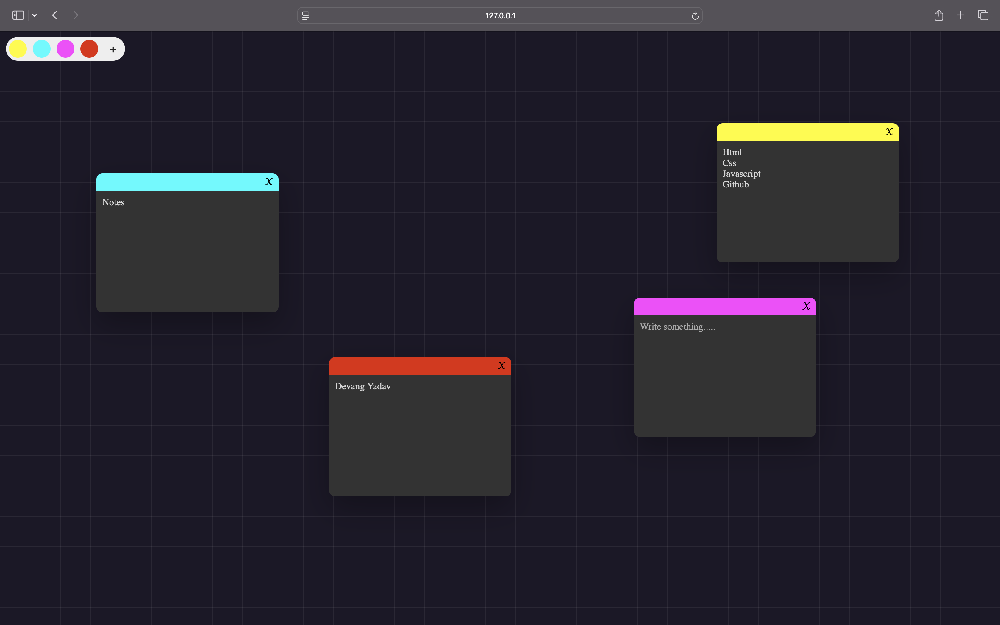

# Sticky-Notes

A simple web application for creating, managing, and saving notes with customizable border colors. Notes are draggable, and their positions and content are saved locally in the browser.

# Demo
<a href="https://devangyadav.github.io/Sticky-Notes">Click Here</a>

## Features

- Create notes with customizable border colors.
- Drag and position notes anywhere on the screen.
- Save notes (including content, border color, and position) in local storage for persistence.
- Delete notes with a simple click.

## Technologies Used

- **HTML**: Structure of the application.
- **CSS**: Styling and layout, including a grid background and responsive design.
- **JavaScript**: Functionality for creating, moving, and saving notes.

## Screenshots



## How to Use

1. **Clone or Download the Repository**
   ```bash
   git clone https://github.com/devangyadav/Sticky-Notes.git
   cd Sticky-Notes
   
2.	Open the Application
    Open the index.html file in any web browser.

3.	Create a Note
	•	Choose a color using one of the color pickers.
	•	Click the + button to create a new note.

4.	Write in the Note
	•	Type directly into the note’s text area.

5.	Drag Notes
	•	Click and hold on a note, then move it to your desired position.

6.	Delete a Note
	•	Click the X button in the corner of the note to delete it.


 # File Structure
```plaintext
├── index.html              # The main HTML structure.
├── style.css               # Styling for the app.
├── script.js               # JavaScript for functionality.
└── README.md               # Project documentation
```

# Technologies Used
- HTML
- Css
- JavaScript

# License
This project is licensed under the [MIT License](LICENSE)


   
